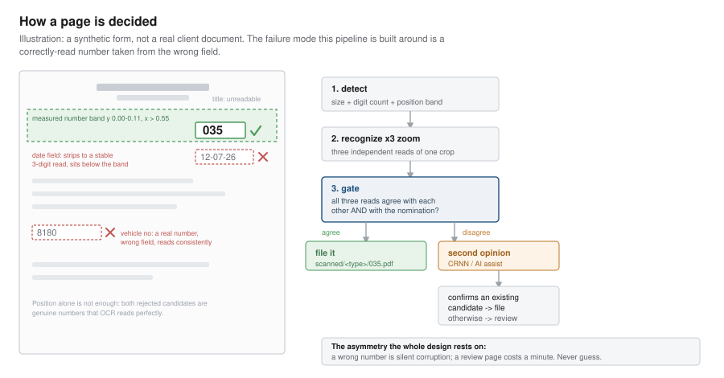

# ECR Document Pipeline

**An offline AI pipeline that reads the handwritten/stamped document number off scanned
warehouse paperwork, classifies what kind of form each page is, and files every page
under its own number — turning a manual page-by-page filing job into a review queue.**

Built for a real chemicals-distribution operation with a multi-year archive of scanned
job cards, delivery challans and gas-cylinder records. It runs entirely on local
hardware: no per-page cloud OCR bill, no document ever leaves the office network.

---



## The problem

Scanned paperwork arrives as multi-page PDF bundles — 30 to 60 pages per file, hundreds
of files. Each page is a separate business record that has to be saved as its own PDF,
named for the number printed or handwritten on it. Doing that by hand means: open the
bundle, look at page 1, find the number, save-as with that number, go to page 2, repeat.
About a minute a page, for an archive approaching a million pages.

Worse than slow, the manual process is *lossy*. Pages that don't get filed don't get
noticed.

## Business impact

Three separate things this buys, in order of how much they actually matter:

### 1. It stops documents being silently lost

The single most valuable finding in the project wasn't a speed-up. A hand audit of 48
pages sampled at random from the pipeline's own discard pile found **10 genuine business
documents in it — about 21%**. Projected across a fiscal year, that is roughly
**1,470 real records a year being thrown away unnoticed**, more than the entire manual
review pass was recovering.

That was fixed by adding a visual page classifier (below). On the 48 hand-labelled pages
the previous version had discarded, the new one **recovers 10 of 10 genuine documents,
with 2 false alarms out of 38 junk pages**. Recovered pages go to review — the system
rescues the page, it does not invent a number for it.

For an operation that may need to produce a specific delivery challan for an audit or a
customer dispute years later, "we can't find it" is a materially worse outcome than "it
took a minute to file".

### 2. It removes about 80% of the human filing time

Measured on a full clean re-run of a real 33-file, 1,712-page test set:

| | before (v1) | after (v2) |
|---|---|---|
| Auto-filed, no human touch | 98 | **531** |
| Needs human review | 767 | 511 |
| Auto-discarded as irrelevant | 861 | 669 |
| **Auto-file rate** (share of relevant pages) | **11.3%** | **51.0%** |

Then a hybrid AI assist pass runs over what's left in the review queue. Measured on 60
real review pages: **25% leave the queue entirely** (two independent readers agreed),
**32% arrive with the number pre-filled for one-click confirmation**, and 43% still need
typing. Before, every review page arrived blank.

Putting those together, with the assumptions stated openly so anyone can recompute:

| Assumption | Value |
|---|---|
| Manual time per relevant page | 60 s (operator-reported) |
| Manual time to glance past an irrelevant page | 10 s |
| Time to confirm a pre-filled suggestion | 5 s |

| | Fully manual | With this pipeline |
|---|---|---|
| Per 1,712-page batch | ~19.2 hours | **~3.9 hours** |
| Effective time per page | ~40 s | **~8 s** |
| Reduction in human time | — | **~80%** |

At the ~1M-page archive scale this was built for, that is roughly **11,200 hours of
manual work reduced to about 2,300 — a saving on the order of 8,900 hours, or ~4.3
person-years.** Multiply by your own loaded hourly rate for a currency figure; the hours
are the measured part, the rate is yours.

The machine time is not free either, and it is stated rather than hidden: the main
archive pipeline runs at **4.98 s/page on 10 workers** (measured over a real 442-page
production run), so a million pages is on the order of 1,400 machine-hours — unattended,
overnight, parallelisable across machines, and costing electricity rather than salary.

### 3. It is accurate enough to trust, and honest about when it isn't

Per-type precision on auto-filed pages, audited against filenames as ground truth:

| Document type | Filed | Correct | Wrong | Precision |
|---|---|---|---|---|
| Gas Cylinder | 104 | 102 | 2 | 98.1% |
| Delivery Challan | 114 | 114 | 0 | 100% |
| Liquid Nitrogen | 14 | 14 | 0 | 100% |
| Liquid Tank Decant | 113 | 113 | 0 | 100% |
| **Overall** | **345** | **343** | **2** | **99.42%** |

The design bias throughout is that **an uncertain page goes to a human, never to a
guess**. A wrong number is silent corruption in an archive nobody re-reads; a page in
the review queue costs a minute. Those are not symmetric, and the whole gate is built
around that asymmetry.

### The other benefits, briefly

- **No cloud dependency and no per-page cost.** Everything runs on local hardware. Cloud
  OCR was evaluated and deliberately used only as a one-time *measurement instrument*
  (~79 free-tier calls to label a ground-truth sample), not as a production dependency —
  at archive scale it would have meant real cost, a network dependency on a clerk's
  workstation, and API-key management.
- **Documents never leave the network** — relevant when the paperwork is customer
  delivery records.
- **Resumable.** Safe to re-run at any time; already-processed files are skipped, so new
  scans dropped in get picked up without redoing anything.
- **The reviewer's job got easier, not just smaller** — the review UI pre-fills a
  suggested number and needs one keypress to confirm.

---

## How it works

```
PDF bundle
    |
    v
 render          page -> pixels (PyMuPDF)
    |
    v
 classify        which form is this?  marker text -> visual classifier fallback
    |            (irrelevant types are discarded here)
    v
 detect          find candidate number regions
    |            filtered by size, digit count, and measured position band
    v
 recognize       read each candidate at 3 zoom levels (RapidOCR / ONNX Runtime)
    |
    v
 gate            do the reads agree with each other AND with the detector's
    |            own nomination?  disagreement -> review, never a guess
    v
 [CRNN second opinion]   consulted only when the gate did not reach a trusted read;
    |                    can confirm an existing candidate, never introduce a new one
    v
 [AI assist pass]        optional; auto-files only when it agrees with the
    |                    deterministic pipeline, otherwise pre-fills a suggestion
    v
 file            scanned/<type>/<number>.pdf  |  review/  |  discarded/
```

**Key components**

- `pipeline/detect.py` — candidate localisation. Every constant in it was measured
  against real pages, and the module's history includes two documented false positives
  (a crossed-out vehicle-number field, and a date field misread as a document number)
  that drove the current filters.
- `pipeline/pageclass.py` — the visual page classifier that fixed the silent-loss
  problem. Trained on 11,453 pages using labels the pipeline had already produced (weak
  supervision), and evaluated on hand-labelled pages from the discard pile rather than a
  random split, because consecutive pages of a bundle share lighting and skew and a
  random split leaks.
- `pipeline/crnn_digits.py` + `training/` — a small CRNN+CTC digit recognizer trained
  from scratch on 158 real digit glyphs extracted from confirmed-correct pages, expanded
  to 20,000 synthetic sequences with augmentation matched to real scan variation, trained
  in ~6 minutes on a laptop GPU, exported to ONNX so production gains no new dependency.
  A digit-only vocabulary can't lose a faint stroke to an unrelated script's glyph the
  way a 6,625-class general recognizer can.
- `pipeline/gate.py` — the agreement logic that decides file-vs-review.
- `app/` — the desktop review UI (pywebview) and a separate data-entry variant.

## The engineering record

[`ENGINEERING_NOTES.md`](ENGINEERING_NOTES.md) is the full calibration and measurement
log — kept because it is the actually interesting part. It documents what was tried,
measured and **rejected**, not just what shipped:

- A CRNN veto on accepted reads: measured at **27 correct files destroyed per wrong file
  caught**. Rejected outright. A weak second opinion is valuable for confirming and
  worthless for rejecting.
- Widening the Liquid Nitrogen band: every setting swept bought coverage with wrong
  values. Left deliberately narrow, with coverage low **on purpose**.
- Letting the AI pass file on its own authority: 97% precision sounds fine until it means
  ~3 wrong numbers per 100 filed against 0.6 for the deterministic path. Changed to
  file only on agreement.
- Anchoring to the printed Urdu title: never fired, measured gain exactly zero, and the
  code was deleted rather than left in — "a mechanism that cannot trigger is worse than
  none, because it reads as though the case is handled."

## Running it

```bash
py -3.12 -m venv .venv
.venv\Scripts\python -m pip install -r requirements.txt

.venv\Scripts\python main.py                 # process everything, or resume
.venv\Scripts\python main.py --limit 50      # smoke test, writes nothing
.venv\Scripts\python main.py --no-copy       # measure only, touch nothing
.venv\Scripts\python app\desktop_app.py      # review UI
```

Python 3.12 specifically: 3.14 has no wheels for `onnxruntime`.

## Configuration — where the API key goes

**The pipeline itself needs no API key.** Detection, recognition, page classification and
the CRNN all run locally on ONNX Runtime. You can process the entire archive with no
credentials configured at all.

One optional feature needs a key: the **AI assist pass** in the review UI, which acts as
a second opinion on pages the deterministic pipeline could not resolve.

| Variable | Needed for | Where to get it |
|---|---|---|
| `GEMINI_API_KEY` | the optional AI assist pass only | Google AI Studio — <https://aistudio.google.com/apikey> |

Put it in a `.env` file in the project root (see `.env.example`). It is read via
`os.environ.get` in `app/gemini_assist.py`; nothing is ever hardcoded. With no key set,
the pipeline runs normally and the assist button is simply unavailable.

## Honest limitations

- **Liquid Nitrogen coverage is deliberately poor** — 1 of 171 filed. Its number field
  has no reliable anchor because the label is Urdu and unreadable to the OCR. Every band
  widening tested bought coverage with wrong values, so it was left alone. Closing it
  properly needs label-image template matching, and would put overall coverage around
  65–70%.
- **Two known recognition errors** (`003`→`033`, `062`→`02`) reach full agreement across
  all three zoom variants because they share one mis-bounded crop, so the gate cannot
  catch them. The veto that would has a worse cost than the errors.
- **Every constant was measured on one site's forms**, and the page classifier was trained
  only on those layouts. Before running this on another warehouse, re-run the failure
  instrumentation. That diagnostic hour is what found the silent document loss in the
  first place.
- **The ~21% genuine-discard rate** comes from 48 hand labels — a 95% CI of roughly
  10–35%. "~1,470 recoverable documents a year" is the right order of magnitude, not a
  precise count.

## A note on data

This repository contains **code and models only**. No scanned documents, customer names,
business reports, credentials or output archives are included, and the `.gitignore` is
written to keep it that way. The measured figures throughout come from runs against the
real archive; the documents themselves stay with the client.

## License

MIT — see [LICENSE](LICENSE).
